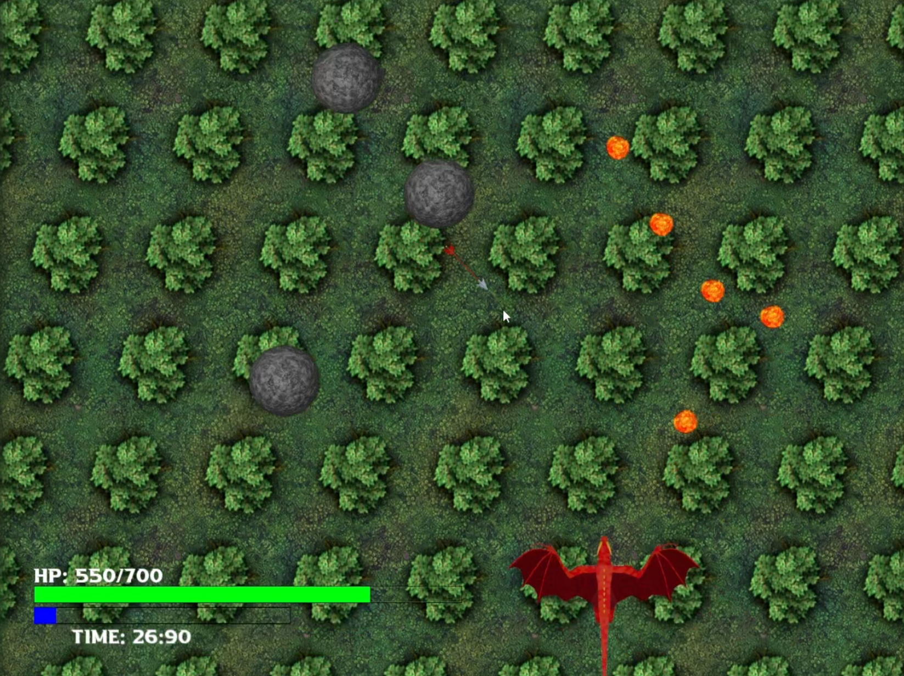
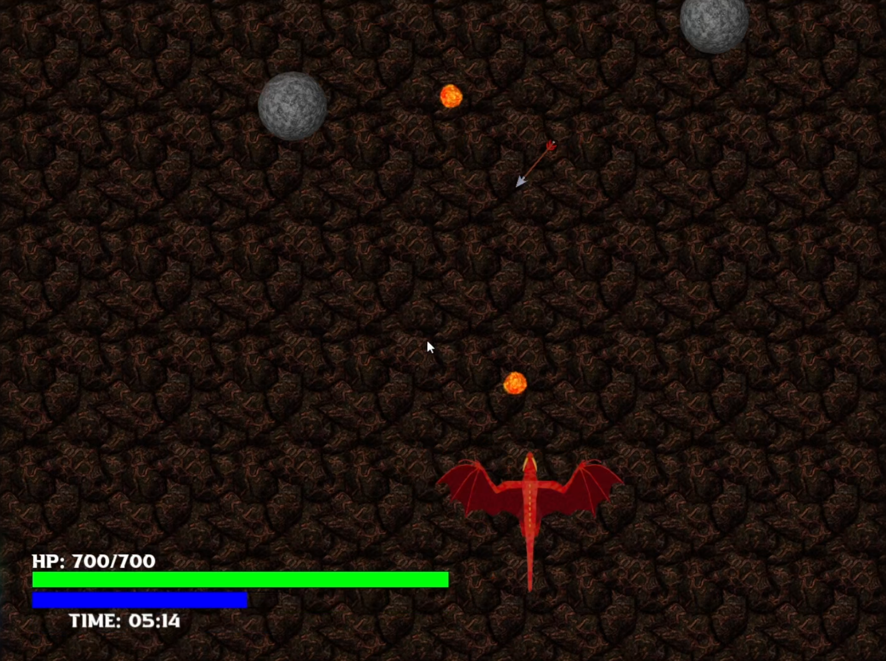
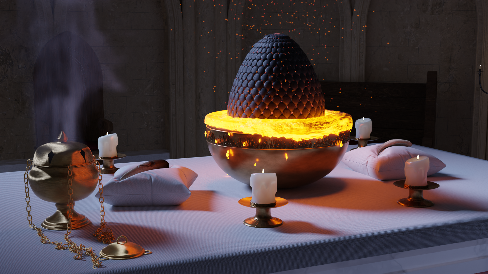

# Project Overview

As part of our university coursework, we undertook two interconnected projects centered around a common theme: dragons. These projects provided us with the opportunity to apply our knowledge in game development and 3D modeling.

## Project 1: Dragon Game Design

In this project, we created a game using OpenGL, where players control a dragon flying through a dynamic environment. The main objective is to navigate the dragon around various obstacles and avoid objects thrown at it. The gameplay is designed to have increasing difficulty as players progress.

### Key Features:
- **Character Design**: The dragon character was modeled in Blender, with different positions of the wings being exported for creating a fluid flying motion, all arranged in sequence as sprites.
- **Dynamic Obstacles**: The weapons thrown at the dragon were also modeled in Blender, ensuring consistency in design and animation. These weapons arrive from different windows, creating a more challenging and unpredictable gameplay experience.
- **Health Points System**: The game incorporates a health points system for the dragon, adding a layer of strategy as players must avoid obstacles to maintain their health.
- **Collectible Power-Ups**: Players can collect power-ups throughout the game, providing temporary boosts that enhance gameplay and increase the dragon's abilities.
- **Theme Customization**: Players have the option to choose the background theme, enhancing the visual appeal and allowing for a more personalized gaming experience.

---

## Project 2: 3D Modeling

The 3D modeling project was developed in Blender, showcasing a visual scene set inside a church, illuminated by light coming from the windows and candles. The focal point is the altar, where dragon claws and an egg are positioned. All elements in the scene were modeled by us, utilizing various techniques.

### Key Features:
- **Dragon Egg Design**: The dragon egg was created using advanced geometry nodes, allowing for intricate designs.
- **Particle System**: A particle system simulating lava adds dynamic visual effects, creating an engaging contrast against the dark surroundings.

---

### Conclusion

These projects not only demonstrate our technical skills in game design and 3D modeling but also reflect our ability to collaborate and innovate in a university setting. Through the use of Blender and OpenGL, we were able to create immersive experiences that capture the imagination of our audience.
